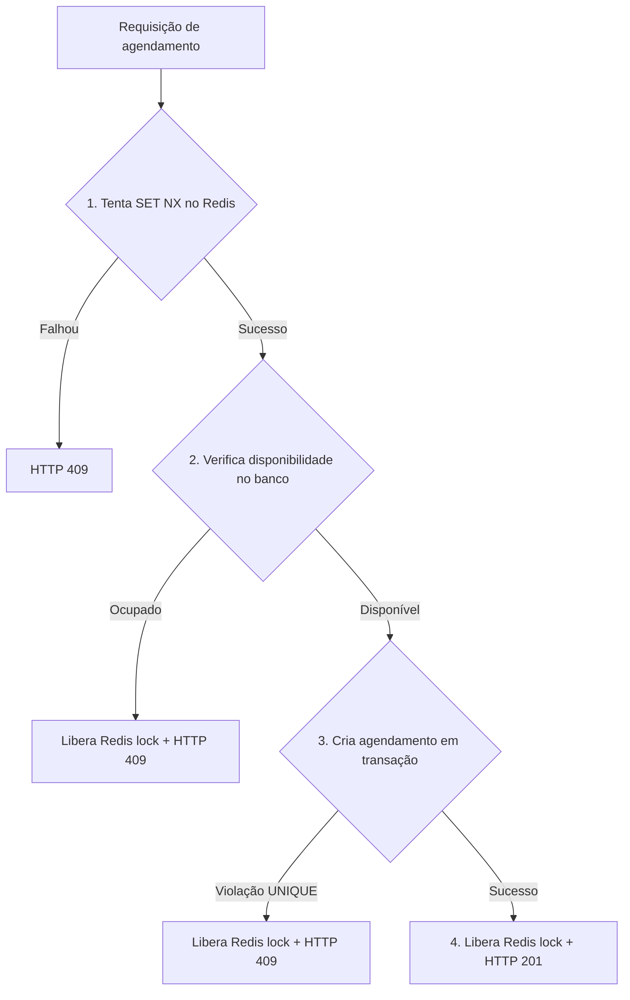

# ADR-0009 — Controle de Concorrência em Agendamentos (Race Condition)

**Status:** Aceito  
**Data:** A definir  
**Contexto:** Lógica de Negócio e Integridade de Dados

---

## Contexto

Dois clientes podem tentar agendar o mesmo horário com o mesmo prestador de forma simultânea. O cache de slots mostra o horário como disponível para ambos. Sem controle de concorrência, ambas as requisições chegam ao banco ao mesmo tempo, passam na verificação de disponibilidade e criam dois agendamentos para o mesmo slot — isso é uma *race condition* clássica e um bug crítico para a reputação do produto.

## Opções consideradas

| Estratégia | Mecanismo | Vantagem | Desvantagem |
| :--- | :--- | :--- | :--- |
| **Pessimistic Lock** | `SELECT ... FOR UPDATE` no PostgreSQL | Simples, garantido pelo banco | Cria contenção: requisições enfileiradas esperam o lock ser liberado |
| **Optimistic Lock** | Campo `version` na tabela; falha se `version` mudou | Sem contenção, boa para baixa colisão | Requer lógica de retry no cliente; complexidade maior |
| **Unique Constraint no banco** | `UNIQUE(prestador_id, data, hora)` | Simplicidade máxima | Apenas captura no último momento; não evita processamento desnecessário |
| **Redis SETNX como mutex + transação PostgreSQL** | Lock distribuído no Redis antes de ir ao banco | Rápido, sem contenção no banco, falha imediata | Requer lógica de lock/unlock e tratamento de TTL expirado |

## Decisão

Abordagem em duas camadas de proteção:

### Camada 1 — Redis Mutex (rápida, evita processamento desnecessário)
Antes de verificar disponibilidade no banco, o sistema tenta adquirir um lock distribuído no Redis para o slot específico:
`SET lock:slot:{prestadorId}:{data}:{hora} {requestId} NX EX 10`

*   **NX**: só cria se não existir (atômico no Redis).
*   **EX 10**: expira automaticamente em 10 segundos (evita deadlock se o processo cair).

Se o `SET` retornar `null`, o slot está sendo processado por outra requisição → retorna HTTP 409 imediatamente.

### Camada 2 — Unique Constraint no PostgreSQL (segurança final)

```sql
ALTER TABLE agendamentos
  ADD CONSTRAINT uq_agendamento_slot
  UNIQUE (prestador_id, data_hora, status)
  WHERE status != 'cancelado';
```

Esta constraint é a última linha de defesa. Se por algum motivo o lock Redis falhar (restart, bug), o banco rejeita a inserção duplicada com erro `23505` que o código trata e converte em HTTP 409.

### Fluxo completo:



## Consequências

- Impossibilidade prática de duplo agendamento no mesmo slot.
- O Redis lock garante resposta imediata de conflito sem pressionar o banco.
- O Unique Constraint do banco é a rede de segurança final e deve sempre existir.
- O `requestId` armazenado no lock permite identificar qual requisição detém o lock para diagnóstico.
- O TTL de 10 segundos no lock deve ser maior que o tempo máximo esperado da transação (~500ms) — ajustar conforme monitoramento em produção.